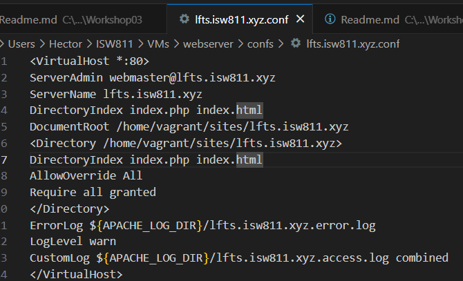
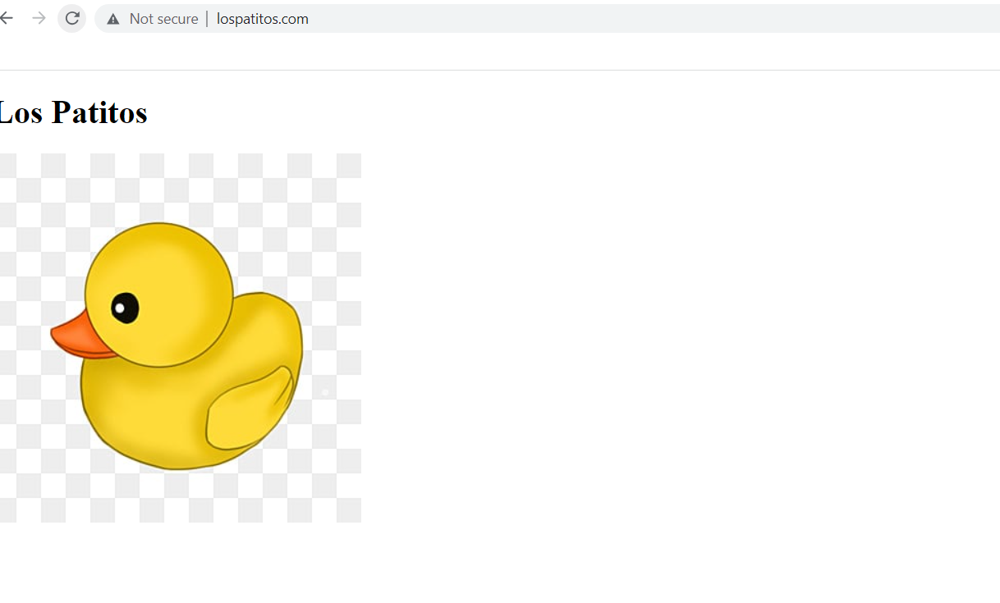
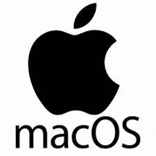
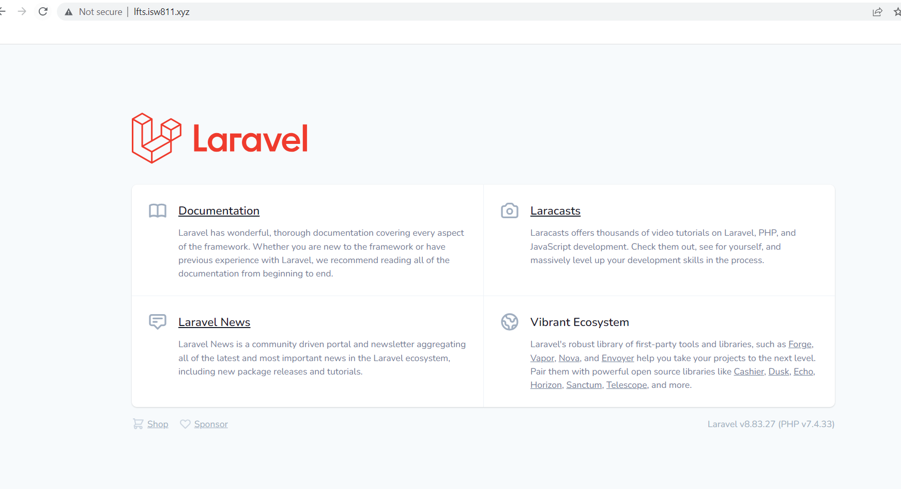

# Worskshop03
## Hector Arias

# Iniciar la Maquina Virtual

 ```bash 
 cd ISW811/VMs/webserver
 vagrant up
 ```

# Editar archivo host en sistema operativo Windows

 Desde un cmd ejecutado como administrador, se puede editar de la siguiente manera.

 ```bash 
 cd Windows\System32\drivers\etc
 notepad hosts
 ```

# Editar archivo host en sistema operativo GNU/Linux

El archivo hosts se encuentra en la ruta /etc/hosts. Desde bash se puede editar con el siguiente comando.

 ```bash 
 sudo nano /etc/hosts
 ```


 # Resolver los dominios que se desean simular

 En el archivo hosts agregamos la entradas correspondientes, para simular la resolución de los dominios deseados.

 ```bash 
 192.168.33.10 lfts.isw811.xyz
 192.168.33.10 lospatitos.com
 192.168.33.10 elblogdehector.com
 ```

# Crear un archivo .conf para cada sitio

En este caso necesitaremos crear un archivo .conf para cada sitio que deseemos hospedar
en el servidor web. 
Esto lo hacemos desde la maquina anfitriona

 ```bash 
cd confs
touch lfts.isw811.xyz.conf
touch lospatitos.com.conf
```

# Editar cada conf
Se editan desde la máquina anfitriona

A continuación el contenido del archivo .conf para el sitio lfts.isw811.xyz



# Alternativa para crear el conf a partir de una plantilla

Es copiar un .conf previamente existente y modificar todas las apariciones del dominio anterior, por el valor correspondiente según el
nuevo dominio que desea hospedar.

Esto se hace desde la maquina anfitriona


 ```bash 
cd confs
cp hectorarias.isw811.xyz.conf elblogdehector.com.conf
sed -i -e 's/hectorarias.isw811.xyz/elblogdehector.com/g' \
elblogdehector.com.conf
```

# Creacion de folders para sitios

En este punto vamos a crear un directorio para cada sitio, junto con el contenido que
deseamos mostrar en cada dominio.
Esto igualmente se hace en la maquina anfitriona con los siguientes comandos 

 ```bash 
cd sites
mkdir elblogdehector.com
mkdir lospatitos.com
mkdir lfts.isw811.xyz
touch elblogdehector.com/index.html
touch lospatitos.com/index.html
```

# Vamos a conectarnos por SSH   
Para conectarse a una máquina Vagrant tipo GNU/Linux por medio de SSH,nos desplazamos hasta la ubicación del Vagrantfile y ejecutamos vagrant ssh.
Esto lo haremos con el siguiente comando

 ```bash 
cd /ISW811/VMs/webserver
vagrant ssh

```

# Copiar los confs
Desde la máquina virtual copiamos todos los archivos .conf desde el directorio /vagrant/confs al directorio de sitios disponibles de Apache2 en
/etc/apache2/sites-available.

Esto lo vamos hacer con los siguientes comandos:

 ```bash 
cd /vagrant/confs
sudo cp * /etc/apache2/sites-available/

```

# Habilitar Sitios

Cuando los archivos .conf se ha copiado al directorio /etc/apache2/sitesavailable se puede proceder con la habilitación de los sitios.

 ```bash 
sudo a2ensite lospatitos.com.conf
sudo a2ensite elblogdehector.com.conf
sudo a2ensite lfts.isw811.xyz.conf

```

# Recargar Apache2

Los sitios habilitados en el paso anterior no estarán realmente disponibles hasta reiniciar o recargar la configuración de Apache2, pero antes de hacerlo
es recomendable revisar que no se hayan introducido errores en ninguno de los archivos .conf.

Esto hace con los siguientes comandos:


 ```bash 
sudo apache2ctl -t
sudo systemctl reload apache2

```
# Descargar Composer
Los dos requisitos indispensables para utilizar el Framework de Laravel son haber instalado en la máquina virtual PHP e instalar Composer <<el gestor de paquetes de PHP>>.

Esto lo haremos con el siguiente comando:

 ```bash 
php -r "copy('https://getcomposer.org/installer','composersetup.php');"
php composer-setup.php
rm composer-setup.php
```

# Instalar Composer

Luego de descargar y generar el binario de «Composer», y vamos a reubicarlo con el siguiente comando:

 ```bash 
sudo mkdir -p /opt/composer/
sudo mv composer.phar /opt/composer/
sudo ln -s /opt/composer/composer.phar /usr/bin/composer
```

# Crear el proyecto Laravel
Ahora vamos al directorio de sitios para crear un nuevo proyecto a partir de la plantilla de Laravel en su versión 8.6.12. Para el curso de «Laravel From The Scratch 8» se deberá trabajar con la versión 8.6.12.


 ```bash 
cd /vagrant/sites
rm -r lfts.isw811.xyz
composer create-project laravel/laravel:8.6.12 lfts.isw811.xyz
```


# Verificar el sitio ----> LosPatitos.com


# Verificar el sitio ----> elblogdehector.com


# Verificar el sitio -----> lfts.isw811.xyz



# Apagar la maquina virtual
Esto lo haremos con el siguiente comando:
 ```bash 
vagrant halt
```
